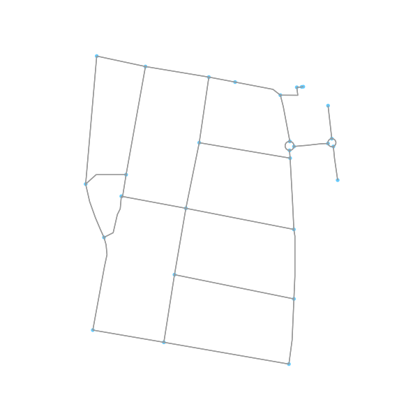
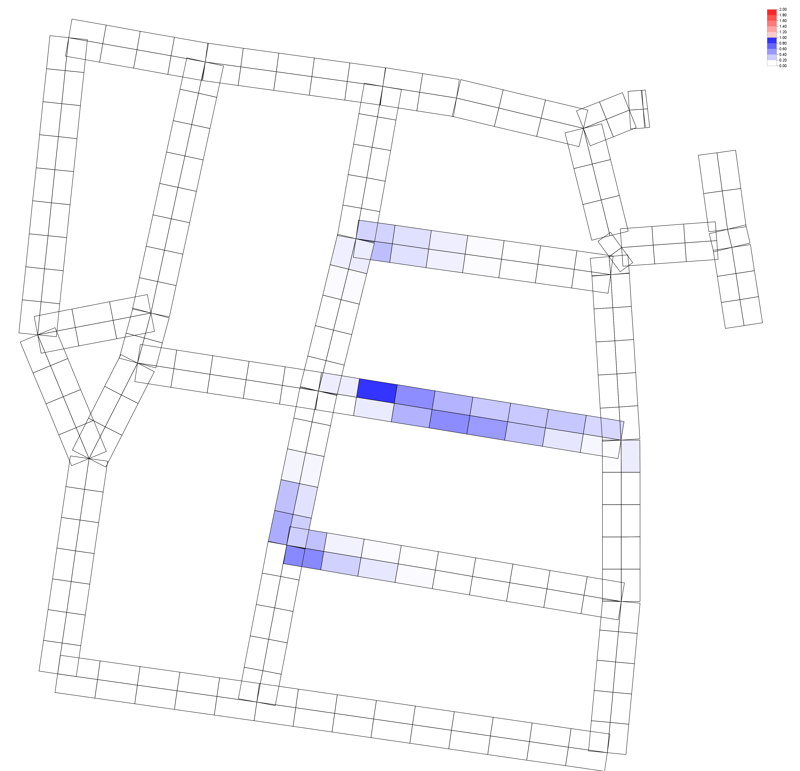

StochasticAnisoPedCTM v1.0
======

StochasticAnisoPedCTM is distributed free of charge. We ask the user to please explicitly mention the use of the package when publishing results, using the following reference:

_____________________________________________________________

Please see LICENSE.md for details on usage.

## About
This java package is an implementation of macroscopic pedestrian loading model for multi-directional, anisotropic, stochastic and congested pedestrian flow. This package can help in analyzing the movement pattern of the pedestrians to enable better planning of the walkways and the repair works which are required which would lead to the lowest impact on traffic.

## New with this version (StochasticAnisoPedCTM v1.0)
- Automated generation of input files based on ODMatrix.
- The street network is generated from OpenStreetMap.org and the desired input files are generated for the simulation.
- Ability to handle multiple route options and split the demand based on the stochastic route choice.
- Introduced time based cell blockage(certain percentage of cell area becomes inaccessible) to simulate repair works or traffic signals.

### Input from OpenStreetMap.org

### Output generated from simulation

## How to use
1. Make sure all the required python libraries are installed. 
The `openstreetmap (osmnx) python library` can be installed using `https://github.com/gboeing/osmnx`
2. If you are in the root directory, parse to the `DataGenerationPython` folder using the command `cd DataGenerationPython`
3. Open the `geo_to_cells.py` file and replace the values of the variables `DISTANCE_RANGE`, `START_POINT`, `MAX_ROUTES`, `odMatrixFileNamePath`, `FILE_CREATION_PATH` with the desired ones.
4. Run the python script `geo_to_cells.py` by running the command in the command shell. `python3 geo_to_cells.py`
5. Now navigate to the src folder by using the command `cd ..\StochasticAnisoPedCTM\src` and execute the `AnisoPedCTM.java` file.

## Reference
Hanseler, F. S., Lam, W. H. K., Bierlaire, M., Lederrey, G., Nikoli ́c, M., 2015. A dynamic network loading model for anisotropic and congested pedestrian flows. Presentation, 4th Annual Conference of The European Association for Research in Transportation, Copenhagen, Denmark.